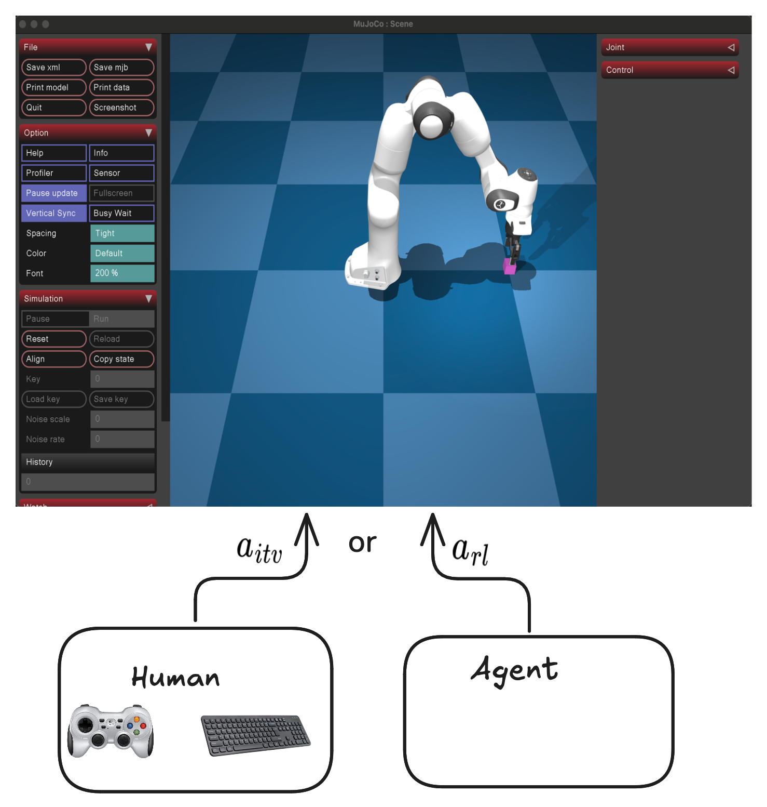

# gym-hil

A collection of gymnasium environments for Human-In-the-Loop (HIL) reinforcement learning, compatible with Hugging Face's LeRobot codebase.

## Overview

The `gym-hil` package provides environments designed for human-in-the-loop reinforcement learning. The list of environments are integrated with external devices like gamepads and keyboards, making it easy to collect demonstrations and perform interventions during learning.

Currently available environments:
- **Franka Panda Robot**: A robotic manipulation environment for Franka Panda robot based on MuJoCo

**What is Human-In-the-Loop (HIL) RL?**

Human-in-the-Loop (HIL) Reinforcement Learning keeps a human inside the control loop while the agent is training. During every rollout, the policy proposes an action, but the human may instantly override it for as many consecutive steps as needed; the robot then executes the human's command instead of the policy's choice. This approach improves sample efficiency and promotes safer exploration, as corrective actions pull the system out of unrecoverable or dangerous states and guide it toward high-value behaviors.

<div align="center">
  
</div>

## Demo Video

<div align="center">
  <a href="https://www.youtube.com/watch?v=99sVWGECBas">
    
  </a>
  <br/>
  <em>Click the image to watch a demo of gym-hil in action!</em>
</div>

We use [HIL-SERL](https://hil-serl.github.io/) from [LeRobot](https://github.com/huggingface/lerobot) to train this policy.  
The policy was trained for **10 minutes** with human in the loop.  
After only 10 minutes of training, the policy successfully performs the task.

## Installation

Create a virtual environment with Python 3.10 and activate it, e.g. with [`miniconda`](https://docs.anaconda.com/free/miniconda/index.html):
```bash
conda create -y -n gym_hil python=3.10 && conda activate gym_hil
```

Install gym-hil from PyPI:
```bash
pip install gym-hil
```
or from source:
```bash
git clone https://github.com/HuggingFace/gym-hil.git && cd gym-hil
pip install -e .
```

## Franka Environment Quick Start

```python
import time
import imageio
import gymnasium as gym
import numpy as np

import gym_hil

# Use the Franka environment
env = gym.make("gym_hil/PandaPickCubeBase-v0", render_mode="human", image_obs=True)
action_spec = env.action_space

obs, info = env.reset()
frames = []

for i in range(200):
    obs, rew, done, truncated, info = env.step(env.action_space.sample())
    # info contains the key "is_intervention" (boolean) indicating if a human intervention occurred
    # If info["is_intervention"] is True, then info["action_intervention"] contains the action that was executed
    images = obs["pixels"]
    frames.append(np.concatenate((images["front"], images["wrist"]), axis=0))

    if done:
        obs, info = env.reset()

env.close()
imageio.mimsave("franka_render_test.mp4", frames, fps=20)
```

## Available Environments

### Franka Panda Robot Environments

- **PandaPickCubeBase-v0**: The core environment with the Franka arm and a cube to pick up.
- **PandaPickCubeGamepad-v0**: Includes gamepad control for teleoperation.
- **PandaPickCubeKeyboard-v0**: Includes keyboard control for teleoperation.

## Teleoperation

For Franka environments, you can use the gamepad or keyboard to control the robot:

```bash
python gym_hil/examples/test_teleoperation.py
```

To run the teleoperation with keyboard you can use the option `--use-keyboard`.

### Human-in-the-Loop Wrappers

The `hil_wrappers.py` module provides wrappers for human-in-the-loop interaction:

- **EEActionWrapper**: Transforms actions to end-effector space for intuitive control
- **InputsControlWrapper**: Adds gamepad or keyboard control for teleoperation
- **GripperPenaltyWrapper**: Optional wrapper to add penalties for excessive gripper actions

These wrappers make it easy to build environments for human demonstrations and interactive learning.

## LeRobot Compatibility

All environments in `gym-hil` are designed to work seamlessly with Hugging Face's LeRobot codebase for human-in-the-loop reinforcement learning. This makes it easy to:

- Collect human demonstrations
- Train agents with human feedback
- Perform interactive learning with human intervention

## Contribute

```bash
# install pre-commit hooks
pre-commit install

# apply style and linter checks on staged files
pre-commit
```

## Acknowledgment

The Franka environment in gym-hil is adapted from [franka-sim](https://github.com/rail-berkeley/serl/tree/main/franka_sim) initially built by [Kevin Zakka](https://kzakka.com/).

## Version History

* v0: Original version
